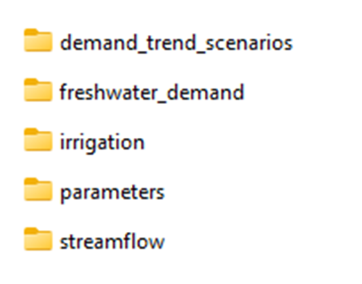
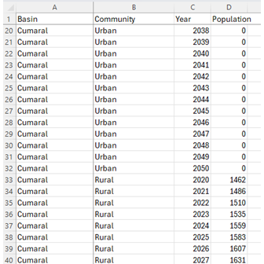
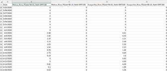
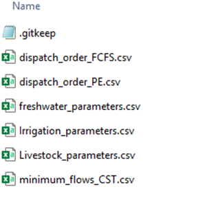
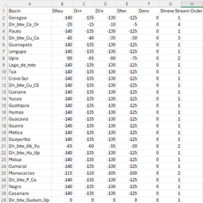
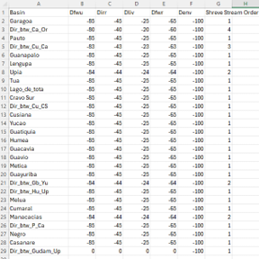
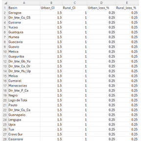
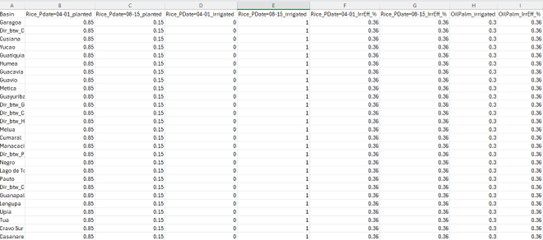
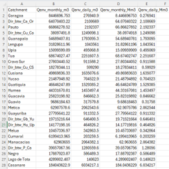
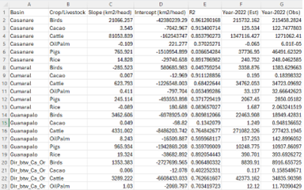

# Orinoquia Water Futures model (OWF)

This repository contains the code for the Orinoquia Water Futures model (OWF), a model designed to simulate land use and land cover changes in the Orinoquia region of Colombia. The model is built using Python and leverages various libraries for data manipulation, analysis, and visualization.

In addition to the OWF model code, the repository includes scripts to run the [GR2M model](https://webgr.inrae.fr/eng/tools/hydrological-models/monthly-hydrological-model-gr2m), which is a simple hydrological model that simulates stream flows at various points of interest along the river network across the Orinoquia Basin. 

The available suite of models also includes the [Aquacrop-OSPy](https://github.com/aquacropos/aquacrop) model, a python implementation of the Aquacrop model, which is a crop growth model developed by the Food and Agriculture Organization (FAO) of the United Nations. The Aquacrop model is designed to simulate the growth and yield of crops under different environmental conditions, including water availability, soil properties, and climate factors. For the purposes of this repository, the Aquacrop model is used to simulate the irrigation requirement for Rice across the basin.

The climate generator used to simulate the future climate scenarios is the [HMMTool](https://iri.columbia.edu/our-expertise/climate/tools/hidden-markov-model-tool/hmmtool/) developed by the International Research Institute (IRI) for climate and society at Columbia University (New York). The HMMTool is a statistical tool that generates synthetic weather data based on historical climate data. It uses a hidden Markov model (HMM) to capture the temporal and spatial patterns of climate variability and generate realistic weather sequences for future scenarios. A GUI is available for the HMMTool, which is not included in this repository. Instructions for using the GUI are available in the [HMMTool documentation](https://iri.columbia.edu/climate/forecast/stochasticTools/userguide.html). 

Future scenarios of temperature and precipitation using the delta change approach using absolute factors for temperature and relative factors.

# Time step

The Orinoquia Water Futures model (OWF) is a monthly model, meaning that it simulates river flows and deliveries to users at a monthly time step. The model uses monthly time steps to capture the seasonal variations in climate and other factors that influence water demand across the Orinoquia region.

Despite being a monthly model, the model still requires input data at a daily time step as one of the first steps of the model is to aggregate the daily data to monthly values. Some input data, like the irrigation requirements for oil palm trees, are only available at a monthly time step. In this case, those data were pre-processed to match the daily time step required by the model (i.e., the monthly values evenly distributed across the month).


# Input and output directories

Github limits the size of files and folders that can be uploaded. Therefore, the input data for the model is not included in the repository. The user must download the data from Google Drive and place it in the correct folder structure.

The input data for the model is available in the following [Google Drive link (input folder)](https://drive.google.com/file/d/1aa3FubYGiNNF81H1SPQ1pM4yI7VqKWgm/view?usp=sharing). The archive contains a single `input` folder that is organized following the folder structure in the Github repository (in fact, it is the `input` folder sitting in the OWF developer local machine). Once downloaded and unzipped, the user can replace the `input` folder in the repository with the downloaded folder.

Likewise, the outputs of the model are available in the following [Google Drive link (results folder)](https://drive.google.com/file/d/1QSdhqU5aAPOTaHBU63t51LLF6p-cWEL7/view?usp=sharing). The archive contains a single `results` folder that is organized following the folder structure in the Github repository.

**IMPORTANT**: The links will remain active up to 30 days after the end of the training course. After that, the link will be deactivated. The user must download the data before the links are deactivated.

# Conda environment and python libraries 

The `env` folder contains the several conda environments used to perform specific tasks. The `env` folder contains the following conda environments:
- `owf_env.yml`: This is the main conda environment used to run the Orinoquia Water Futures model (OWF). It includes all the necessary packages and dependencies required for the model to function properly. The environment is based on Python 3.810 and includes packages such as pandas, numpy, geopandas, matplotlib, pywr, and others.
- `owf_plot.yml`: This conda environment is used to run the OWF plotting scripts. It includes packages such as matplotlib, seaborn, and geopandas, plotly, which are required for data visualization and plotting.
- `aquacrop_env.yml`: This conda environment is used to run the Aquacrop-OSPy model. It includes packages such as pandas, numpy, and aquacrop, which are required for running the Aquacrop model.
- `cmip6_env.yml`: This conda environment is used to download the CMIP6 projections, and more specifically to run the `download_CMIP6_projections.py` script. It includes packages such as xarray, netCDF4, and cftime, which are required for downloading and processing the CMIP6 projections, and the cdsapi package, which is required to download the CMIP6 projections from the Copernicus Climate Data Store (CDS).

Note that some of the scripts used to create figures required python library that have been developed by the author of the OWF model. These libraries are not included in this repository, but they can be downloaded from the following links:
- [CST_PlottingTools](https://github.com/BaptisteFrancois/CST_PlottingTools)
- [CSTProjTools](https://github.com/BaptisteFrancois/ClimProjTools)


However, the user is not required to download and use these libraries to run the model. The user can also develop its own scripts to plot the results of the model.


# Running the model
To run the Orinoquia Water Futures Model (OWF), the user must follow these steps:

1. **Install the conda environment**: The user must install the conda environment `owf_env.yml` using the following command:
   ```bash
   conda env create -f env/owf_env.yml
   ```
   This will create a new conda environment named `owf_env` with all the necessary packages and dependencies.
2. **Activate the conda environment**: The user must activate the conda environment using the following command:
   ```bash
    conda activate owf_env
    ```
3. **Run the model**: The user can run the model using the following command:
   ```bash
   python OWF_CST.py
   ```
   This will run the Orinoquia Water Futures model (OWF) and generate the output files in the `results` folder.

The above python command runs the OWF model for the climate scenarios and demand projections defined in the `OWF_ScenarioVariables.py` file.

One of the parameters that can be modified in the `OWF_ScenarioVariables.py` is the number of cpus to use to run the model (see below).

```python
# Number of cpus to use for the CST simulations
nb_cpus = 1
```

Depending on the number of cpus available in the user's machine, the user can modify this parameter to use more cpus to run the model. For example, if the user has 4 cpus available, the user can set `nb_cpus = 4`. This will allow the model to run multiple simulations in parallel, which can significantly speed up the model execution time. Note that if the user sets a large number of cpus, the model will not run properly and may crash as Windows and other software and programs running in the user's machine may use resources from the same cpus. 

When running the model, the `.json` files for each scenarios are created in the `model_json/CST/models/` folder using the `Build_OWF_CST.py`. Note that the user does not need to run the `Build_OWF_CST.py` python module, as this module is executed automatically when the `OWF_CST.py` is run.

The template used to create the `.json` files is available in the `model_json/CST/Parent/` folder. An advanced user willing to modify the structure of the model can modify the template to change the model configuration, such as the number of basins, the number of water users, and other parameters. It is advised to make a copy of the template before modifying it.

Note that a second `.json` file is located in the `model_json/CST/Parent/` folder. This `.json` file, `delivery_and_demand_outputs.json`, is used to list the recorders that are use to output the deliveries and demands for the nodes representing water users in the Orinoquia region. 


# OWF input files

The OWF model requires several input files to run. The input files are organized in the `input` folder (figure below). 



## freshwater_demand

The `freshwater_demand` folder contains the freshwater demand projections for the Orinoquia region. The folder includes the `CST/Projection_Urban_and_Rural_Population_for_OWF_CST.csv` file, which contains the urban and rural population projections for the Orinoquia region. The population projections are used to estimate the freshwater demand for urban and rural areas in the region. The file is structured as follows:



The scenario keys `Dfwu` and `Dfwr` defined in the `OWF_ScenarioVariables.py` file are used to select the freshwater demand projections for urban and rural areas, respectively. The user can modify these keys to select different scenarios for the freshwater demand projections.

The population projections for the years spanning from 2020 to 2050 are extrapolated from historical records of the population in the Orinoquia Region using linear regression. The projections are based on the assumption that the population will continue to grow at a similar rate as in the past. The projections and the `Projection_Urban_and_Rural_Population_for_OWF_CST.csv` were created using the `Trend_Urban_and_Rural_Population_for_OWF_CST.py` python script available in the `scripts` folder of the repository.

## Irrigation

The `irrigation` folder contains the irrigation requirements for the crops in the Orinoquia region. The directory includes the `CST` folder that contains the irrigation requirements for rice and palm oil tree in the Orinoquia region.

- `Aquacrop` folder: This folder contains the Aquacrop-OSPy model output files, which are used to simulate the irrigation requirements for rice in the Orinoquia region. The file is structured as follows:

    

    The provided version of the Aquacrop-OSPy model simulations contain for each basin the irrigation requirements (mm) for rice planted at two different dates: April 1st (dry season) and August 15th (wet season). Simulations are daily but the irrigation requirements get aggregated to monthly values in OWF.

    Should the user want to run the Aquacrop-OSPy model for other crops, plantation dates, .., the user can use the `aquacrop_env.yml` conda environment to run the Aquacrop-OSPy model. 

    Aquacrop-OSPy requieres weather data to run the simulations. The weather data used in the simulations is available in the `input/weather` folder. 

- `OilPalm` folder: This folder contains the irrigation requirements for oil palm trees in the Orinoquia region. The irrigation requirements are based on the FAO guidelines (KxPET approach) for oil palm cultivation and are used to estimate the irrigation requirements for oil palm trees in the Orinoquia region. The `.csv` file contains the irrigation requirements for oil palm trees in the Orinoquia region. Note that, contrary to irrigation requirement for Rice, the requirement for oil pam tree is provided in meter. The file is structured such that each row corresponds to a month and each column corresponds to a basin. 


## parameters

The `parameters` folder contains several parameter files controlling water demand and dispatch across the Orinoquia Water Futures Model. 



### dispatch_order_*.csv
These files contain the `cost` attributes values assigned to the different `output` nodes representing users across the basin, hence representing the dispatch order for those users in the Orinoquia region. The dispatch order is used to determine the priority of water users in the Orinoquia region. 

Remind that nodes with a lower `cost` value are prioritized over nodes with a higher `cost` value since `pywr` solves a cost-minimization problem to determine the water allocation across the basin. 


The files are structured such that each row corresponds to a water user and each column corresponds to a basin. The values in the file represent the priority of the water user in the basin, with lower values indicating higher priority.

Below is a screenshot of the `dispatch_order_FCFS.csv` file, which contains the dispatch order for the First-Come-First-Serve (FCFS) scenario. The FCFS scenario is a  dispatch order where the water users are prioritized based on their type with a basin with no consideration of the users downstream.



Contrary to the FCFS scenario, the `dispatch_order_PE.csv` file contains the dispatch order for the Policy Enforced (PE) scenario. In this scenario, all water users from the same category (i.e., urban customers) are considered to have the same priority whatever their locations (i.e., upstream or downstream) in the basin. The dispatch order for the PE scenario is shown below:



Note: in the two screenshots above, the `Shree Stream Order` column is not used in the model. It is only used to indicate the stream order of the water used in the river network. High values of the stream order indicate that the basin is located downstream in the river network, while low values indicate that the basin is located upstream in the river network.

   
### freshwater_parameters.csv 
This file contains the freshwater parameters for the Orinoquia region. The file is structured such that each row corresponds to a basin and each column corresponds to a parameter. 



The parameters include multipliers applied to the demand to account for water demand from commercial and industrial buildings. By default, the urban population water demand is multiplied by 1.5 (increased by 50%; `Urban_CI=1.5`) while no demand multiplier is applied to the rural population (`Rural_CI=0`).

In addition, a loss parameter is applied to the demand to account for water losses in the distribution system. This loss parameter is set by default to 0.25 for all basins and for both rural and urban communities (columns `Urban_loss_%` and `Rural_loss_%`). The pre-loss demand  is divided by (1-loss) to account for the losses in the distribution system. For instance, if the pre-loss demand is 100 m3/s and the loss parameter is set to 0.25, the post-loss demand will be 100/(1-0.25) = 133.33 m3/s.


### Irrigation_parameters.csv
This file contains the irrigation parameters for the crops in the Orinoquia region. 



For the two planted dates of rice and the oil palm trees, the file contains the fraction of the planted area that is irrigated (i.e., parameters `*_irrigated`, where `*` is the crop name). 

For the rice, it also contains the fraction of the planted area that is either planted in the dry season (April 1st - `Rice_Pdate=04-01_planted`) or in the wet season (August 15th - `Rice_Pdate=08-15_planted`).

Next, the file also includes the irrigation efficiency for the crops in the Orinoquia region (`*_IrrErr_%`). The irrigation simulated by the Aquacrop-OSPy model is the net irrigation requirement, which is the amount of water that needs to be applied to the crops to meet their irrigation requirements. The irrigation efficiency is used to convert the net irrigation requirement into the gross irrigation requirement, which is the amount of water that needs to be diverted from the river to meet the irrigation requirements of the crops.

### minimum_flows_CST.csv
This file contains the minimum flow requirements for the Orinoquia region. The minimum flow requirements were calculated using the `environmental_flow_calculation_CST.py` script available in the `scripts` folder of the repository. 



## demand_trend_scenarios

The `demand_trend_scenarios` folder contains the demand trend scenarios for the Orinoquia region. The folder includes the `CST` folder that contains the `Trend_CropType_and_Livestock_OWF.csv` file that contains data on historical trends and for rice, cacao and oil palm tree planted areas, and for livestock numbers in the Orinoquia region (pigs, birds and cattle). The calculation of the irrigation and livestock demand uses the values from the `Slope (km2/head)` and `Intercept (km2/head)` columns to calculate the demand for each crop and livestock type in each basin. Other columns in the file are used to assess the trend in the crop and livestock areas across the Orinoquia region. Predicted and observed values for the year 2022 are provided for this purpose.




## Streamflow

The streamflow folder contains the streamflow data for the Orinoquia region. The folder includes the `CST` folder that contains `.csv` files that includes time series of average daily flow for each month and for all basins in the Orinoquia region. 

The directory also contains the `GR2M_PARAMETERS_META_V03.csv` file, which contains the parameters used to run the GR2M model for the Orinoquia region. 

