# Orinoquia Water Futures model (OWF)

## 1. Overview

This repository contains the code for the Orinoquia Water Futures model (OWF), a model designed to simulate water deliveries to users and river flows across the Orinoquia region of Colombia. The model is built using Python and leverages various open source libraries.

In addition to the OWF model code, the repository includes scripts to run the [GR2M model](https://webgr.inrae.fr/eng/tools/hydrological-models/monthly-hydrological-model-gr2m), which is a simple hydrological model that simulates natural flows at various points of interest along the river network across the Orinoquia Basin. 

The available suite of models also includes the [Aquacrop-OSPy](https://github.com/aquacropos/aquacrop) model, a python implementation of the Aquacrop model, which is a crop growth model developed by the Food and Agriculture Organization (FAO) of the United Nations. The Aquacrop model is designed to simulate the growth and yield of crops under different environmental conditions, including water availability, soil properties, and climate factors. For the purposes of this repository, the Aquacrop model is used to simulate the irrigation requirement for Rice across the basin.

The climate generator used to simulate the future climate scenarios is the [HMMTool](https://iri.columbia.edu/our-expertise/climate/tools/hidden-markov-model-tool/hmmtool/) developed by the International Research Institute (IRI) for climate and society at Columbia University (New York). The HMMTool is a statistical tool that generates synthetic weather data based on historical climate data. It uses a hidden Markov model (HMM) to capture the temporal and spatial patterns of climate variability and generate realistic weather sequences for future scenarios. A GUI is available for the HMMTool, which is not included in this repository. Instructions for using the GUI are available in the [HMMTool documentation](https://iri.columbia.edu/climate/forecast/stochasticTools/userguide.html). 

Future scenarios of temperature and precipitation using the delta change approach using absolute factors for temperature and relative factors.

## 2. Time step

The Orinoquia Water Futures model (OWF) is a monthly model, meaning that it simulates river flows and deliveries to users at a monthly time step. The model uses monthly time steps to capture the seasonal variations in climate and other factors that influence water supply and demand across the Orinoquia region.

Despite being a monthly model, the model still requires input data at a daily time step as one of the first steps of the model is to aggregate the daily data to monthly values (this is a requirement of the `pywr` python libraries used in OWF). Some input data, like the irrigation requirements for oil palm trees or the GR2M streamflow simulations, are only available at a monthly time step. In this case, those data were pre-processed to match the daily time step required by the model by evenly distributing the monthly values across the months.


## 3. Input and output directories

Github limits the size of files and folders that can be uploaded. Therefore, the input data for the model is not included in the repository. The user must download the data from Google Drive and place it in the correct folder structure.

The input data for the model is available in the following [Google Drive link (input folder)](https://drive.google.com/file/d/1aa3FubYGiNNF81H1SPQ1pM4yI7VqKWgm/view?usp=sharing). The archive contains a single `input` folder that is organized following the folder structure in the Github repository (in fact, it is the `input` folder sitting in the OWF developer local machine). Once downloaded and unzipped, the user can replace the `input` folder in the repository with the downloaded folder.

Likewise, the outputs of the model are available in the following [Google Drive link (results folder)](https://drive.google.com/file/d/1QSdhqU5aAPOTaHBU63t51LLF6p-cWEL7/view?usp=sharing). The archive contains a single `results` folder that is organized following the folder structure in the Github repository.

**IMPORTANT**: The links will remain active up to 30 days after the end of the training course. After that, the link will be deactivated. The user must download the data before the links are deactivated.

## 4. Conda environment and python libraries 

The `env` folder contains the several conda environments used to perform specific tasks. The `env` folder contains the following conda environments:
- `owf_env.yml`: This is the main conda environment used to run the Orinoquia Water Futures model (OWF). It includes all the necessary packages and dependencies required for the model to function properly. The environment is based on Python 3.810 and includes packages such as pandas, numpy, geopandas, matplotlib, pywr, and others.
- `owf_plot.yml`: This conda environment is used to run the OWF plotting scripts. It includes packages such as matplotlib, seaborn, and geopandas, plotly, which are required for data visualization and plotting.
- `aquacrop_env.yml`: This conda environment is used to run the Aquacrop-OSPy model. It includes packages such as pandas, numpy, and aquacrop, which are required for running the Aquacrop model.
- `cmip6_env.yml`: This conda environment is used to download the CMIP6 projections, and more specifically to run the `download_CMIP6_projections.py` script. It includes packages such as xarray, netCDF4, and cftime, which are required for downloading and processing the CMIP6 projections, and the cdsapi package, which is required to download the CMIP6 projections from the Copernicus Climate Data Store (CDS).

Note that some of the scripts used to create figures required python library that have been developed by the author of the OWF model. These libraries are not included in this repository, but they can be downloaded from the following links:
- [CST_PlottingTools](https://github.com/BaptisteFrancois/CST_PlottingTools)
- [CSTProjTools](https://github.com/BaptisteFrancois/ClimProjTools)


However, the user is not required to download and use these libraries to run the model. The user can also develop its own scripts to plot the results of the model.


## 5. Running the model
To run the Orinoquia Water Futures Model (OWF), the user must follow these steps:

1. **Install the conda environment**: The user must install the conda environment `owf_env.yml` using the following command:
   ```bash
   conda env create -f env/owf_env.yml
   ```
   This will create a new conda environment named `owf_env` with all the necessary packages and dependencies.
2. **Activate the conda environment**: The user must activate the conda environment using the following command:
   ```bash
    conda activate owf_env
    ```
3. **Run the model**: The user can run the model using the following command:
   ```bash
   python OWF_CST.py
   ```
   This will run the Orinoquia Water Futures model (OWF) and generate the output files in the `results` folder.

The above python command runs the OWF model for the climate scenarios and demand projections defined in the `OWF_ScenarioVariables.py` file.

One of the parameters that can be modified in the `OWF_ScenarioVariables.py` is the number of cpus to use to run the model (see below).

```python
# Number of cpus to use for the CST simulations
nb_cpus = 1
```

Depending on the number of cpus available in the user's machine, the user can modify this parameter to use more cpus to run the model. For example, if the user has several cpus available on their computer, they can for instance set `nb_cpus = 4`. This will allow the model to run multiple simulations in parallel, which can significantly speed up the model execution time. Note that if the user sets a large number of cpus, the model will not run properly and may crash as Windows and other softwares and programs running in the user's machine may use resources from the same cpus. 

When running the model, the `.json` files for each scenario are created in the `model_json/CST/models/` folder using the `Build_OWF_CST.py`. The purpose of the `Build_OWF_CST.py` is for the most part to fill the relevant `url` attributes that points to the input files used by the model to run a specific scenario. Other attributes are also filled or updated based on the scenario selected in the `OWF_ScenarioVariables.py` file. For instance, the `cost` attributes of the nodes representing water users in the Orinoquia region are updated based on the dispatch order defined in the `dispatch_order_*.csv` files located in the `parameters` folder (more details are provided below).

 Note that the user does not need to run the `Build_OWF_CST.py` python module, as this module is executed automatically when executing the `OWF_CST.py` script.

The template used to create the `.json` files is available in the `model_json/CST/Parent/` folder. An advanced user willing to modify the structure of the model can modify the template to change the model configuration, such as the number of basins, the number of water users, and other parameters. It is advised to make a copy of the template before modifying it.

Note that a second `.json` file is located in the `model_json/CST/Parent/` folder. This `.json` file, `delivery_and_demand_outputs.json`, is used to list the recorders that are use to output the deliveries and demands for the nodes representing water users in the Orinoquia region. 


## 6. OWF input files

The OWF model requires several input files to run. The input files are organized in the `input` folder (figure below). 

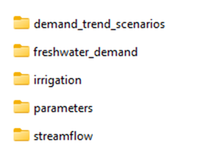

*Screenshot of the `input` folder located in the root directory of the repository*

### 6.1 freshwater_demand

The `freshwater_demand` folder contains the freshwater demand projections for the Orinoquia region. The folder includes the `CST/Projection_Urban_and_Rural_Population_for_OWF_CST.csv` file, which contains the urban and rural population projections for the Orinoquia region. The population projections are used to estimate the freshwater demand for urban and rural areas in the region. The file is structured as follows:

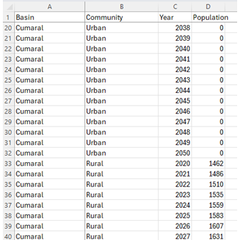

*Screenshot of the `Projection_Urban_and_Rural_Population_for_OWF_CST.csv` file located in the `input/freshwater_demand/CST/` directory*

The scenario keys `Dfwu` and `Dfwr` defined in the `OWF_ScenarioVariables.py` file are used to select the freshwater demand projections for urban and rural areas, respectively. The user can modify these keys to select different scenarios for the freshwater demand projections.

The population projections for the years spanning from 2020 to 2050 are extrapolated from historical records of the population in the Orinoquia Region using linear regression. The projections are based on the assumption that the population will continue to grow at a similar rate as in the past. The projections and the `Projection_Urban_and_Rural_Population_for_OWF_CST.csv` were created using the `Trend_Urban_and_Rural_Population_for_OWF_CST.py` python script available in the `scripts` folder of the repository.

### 6.2 Irrigation

The `irrigation` folder contains the irrigation requirements for the crops in the Orinoquia region. The directory includes the `CST` folder that contains the irrigation requirements for rice and palm oil tree in the Orinoquia region.

- `Aquacrop` folder: This folder contains the Aquacrop-OSPy model output files, which are used to simulate the irrigation requirements for rice in the Orinoquia region. The file is structured as follows:

    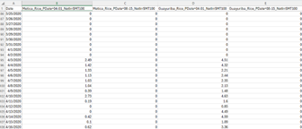

    *Screenshot of one file located in `input/irrigation/CST/` directory*

    The provided version of the Aquacrop-OSPy model simulations contain for each basin the irrigation requirements (mm per day) for rice planted at two different dates: April 1st (dry season) and August 15th (wet season). Simulations are daily but the irrigation requirements get aggregated to monthly values in OWF. They were obtained using the `ORINOQUIA_aquacrop_CST_NetIrrSMT100.py` python script.

    Aquacrop offers a large panel of options to simulate the irrigation requirements for different crops, plantation dates, and other parameters. It also offer the choice of different irrigation strategies. For the purposes of the OWF modeling framework, we use the Net Irrigation Soil Moisture Target (NetIrrSMT) irrigation strategy, which is a strategy that aims to maintain the soil moisture at a target level. The target level is set to 100% of the soil moisture capacity, which means that the irrigation is applied to maintain the soil moisture at its maximum level.

    Should the user want to run the Aquacrop-OSPy model for other crops, plantation dates, etc, the user can use the `aquacrop_env.yml` conda environment to run the Aquacrop-OSPy model. 

    Aquacrop-OSPy requires weather data to run the simulations. The weather data used in the simulations is available in the `input/weather` folder. 

- `OilPalm` folder: This folder contains the irrigation requirements for oil palm trees in the Orinoquia region. The irrigation requirements are based on the FAO guidelines (KxPET approach) for oil palm cultivation and are used to estimate the irrigation requirements for oil palm trees in the Orinoquia region. The `.csv` file contains the irrigation requirements for oil palm trees in the Orinoquia region. Note that, contrary to irrigation requirement for Rice, the requirement for oil pam tree is provided in meter per day. The files are structured such that each row corresponds to a day and each column corresponds to a basin. 


### 6.3 parameters

The `parameters` folder contains several parameter files controlling water demand and dispatch across the Orinoquia Water Futures Model. 

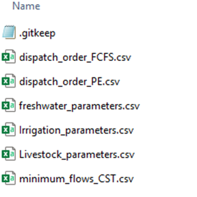

*Screenshot of the `parameters` folder located in the `input` directory of the repository*

#### 6.3.1 dispatch_order_*.csv
These files contain the `cost` attributes values assigned to the different `output` nodes representing users across the basin, hence representing the dispatch order for those users in the Orinoquia region. The dispatch order is used to determine the priority of water users in the Orinoquia region. 

Remind that nodes with a lower `cost` value are prioritized over nodes with a higher `cost` value since `pywr` solves a cost-minimization problem to determine the water allocation across the basin. 


The files are structured such that each column corresponds to a water user and each row corresponds to a basin. The keys used to represent the water users in the columns are:
- `Dfwu`: demand for urban water users
- `Dfwr`: demand for rural water users
- `Dirr`: demand for irrigation water users
- `Dliv`: demand for livestock water users
- `Denv`: demand for environmental flows


The values in the file represent the priority of the water user in the basin, with lower values indicating higher priority.

Below is a screenshot of the `dispatch_order_FCFS.csv` file, which contains the dispatch order for the First-Come-First-Serve (FCFS) scenario. The FCFS scenario is a  dispatch order where the water users are prioritized based on their type with no consideration of the users downstream.

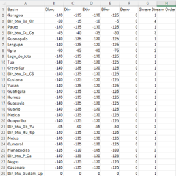

*Screenshot of the `dispatch_order_FCFS.csv` file located in the `input/parameters/` directory*

Contrary to the FCFS scenario, the `dispatch_order_PE.csv` file contains the dispatch order for the Policy Enforced (PE) scenario. In this scenario, all water users from the same category (e.g., urban customers) are considered to have the same priority whatever their locations (e.g., upstream or downstream) in the basin. The dispatch order for the PE scenario is shown below:

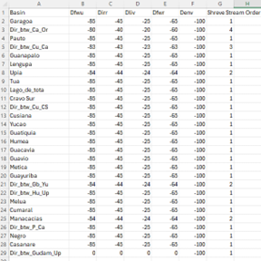

*Screenshot of the `dispatch_order_PE.csv` file located in the `input/parameters/` directory*

Note: in the two screenshots above, the `Shree Stream Order` column is not used in the model. It is only used to indicate the stream order of the water used in the river network. High values of the stream order indicate that the basin is located downstream in the river network, while low values indicate that the basin is located upstream in the river network.

   
#### 6.3.2 freshwater_parameters.csv 
This file contains the freshwater parameters for the Orinoquia region. The file is structured such that each row corresponds to a basin and each column corresponds to a parameter. 

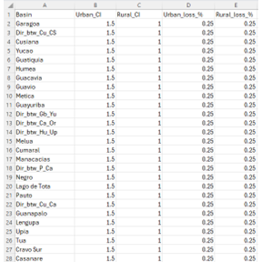

The parameters include multipliers applied to the demand to account for water demand from commercial and industrial buildings. By default, the urban population water demand is multiplied by 1.5 (increased by 50%; `Urban_CI=1.5`) while no demand multiplier is applied to the rural population (`Rural_CI=1`).

In addition, a loss parameter is applied to the demand to account for water losses in the distribution system. This loss parameter is set by default to 0.25 for all basins and for both rural and urban communities (columns `Urban_loss_%` and `Rural_loss_%`). The pre-loss demand  is divided by (1-loss) to account for the losses in the distribution system. For instance, if the pre-loss demand is 100 m3/s and the loss parameter is set to 0.25, the post-loss demand will be 100/(1-0.25) = 133.33 m3/s.


#### 6.3.3 Irrigation_parameters.csv
This file contains the irrigation parameters for the crops in the Orinoquia region. 

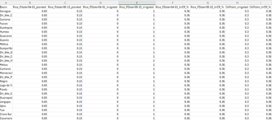

*Screenshot of the `Irrigation_parameters.csv` file located in the `input/parameters/` directory*

For the two planted dates of rice and the oil palm trees, the file contains the fraction of the planted area that is irrigated (i.e., parameters `*_irrigated`, where `*` is the crop name). 

For the rice, it also contains the fraction of the planted area that is either planted in the dry season (April 1st - `Rice_Pdate=04-01_planted`) or in the wet season (August 15th - `Rice_Pdate=08-15_planted`).

Next, the file also includes the irrigation efficiency for the crops in the Orinoquia region (`*_IrrErr_%`). The irrigation simulated by the Aquacrop-OSPy model is the net irrigation requirement, which is the amount of water that needs to be applied to the crops to meet their irrigation requirements. The irrigation efficiency is used to convert the net irrigation requirement into the gross irrigation requirement, which is the amount of water that needs to be diverted from the river to meet the irrigation requirements of the crops.

#### 6.3.4 minimum_flows_CST.csv
This file contains the minimum flow requirements for the Orinoquia region. The minimum flow requirements were calculated using the `environmental_flow_calculation_CST.py` script available in the `scripts` folder of the repository. 

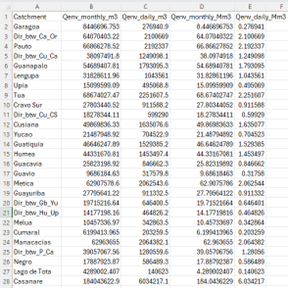

*Screenshot of the `minimum_flows_CST.csv` file located in the `input/parameters/` directory*

### 6.4 demand_trend_scenarios

The `demand_trend_scenarios` folder contains the demand trend scenarios for the Orinoquia region. The folder includes the `CST` folder that contains the `Trend_CropType_and_Livestock_OWF.csv` file that contains data on historical trends and for rice, cacao and oil palm tree planted areas, and for livestock numbers in the Orinoquia region (pigs, birds and cattle). The calculation of the irrigation and livestock demand uses the values from the `Slope (km2/head)` and `Intercept (km2/head)` columns to calculate the demand for each crop and livestock type in each basin. Other columns in the file are used to assess the trend in the crop and livestock areas across the Orinoquia region. Predicted and observed values for the year 2022 are provided for this purpose.

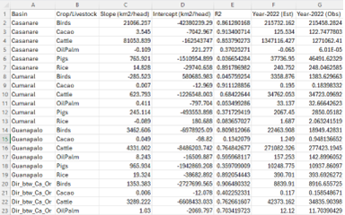


### 6.5 Streamflow

The streamflow folder contains the streamflow data for the Orinoquia region. The folder includes the `CST` folder that contains `.csv` files that includes time series of average daily flow for each month and for all basins in the Orinoquia region. 

 The `run_GR2M_CST.py` script available in the `scripts` folder of the repository is used to run the GR2M model for the Orinoquia region. The script uses the parameters from the `GR2M_PARAMETERS_META_V03.csv` file to run the GR2M model and generate the streamflow data for the Orinoquia region.


## 7. Customized parameters

In OWF, the calculation of the water demand to customers is made via customized `pywr` parameters that are implemented via python classes. 

### 7.1 Classes and Class instances

A class instance is a specific object created from a Python class. While this can seem a bit semantic, it is important - the class is a template that encapsulates features (called attributes) and behaviors (called methods) common to all members (instances) of the class. An instance of the class is a specific implementation of that template. For a general example, consider a class representing a person; while all people have a similar template, each is a unique instance of the class:

```python
# class template (definition)
class Person:
    # Initialize the class with attributes
    def __init__(self, name, height_m, weight_kg):
        self.name = name
        self.height = height_m
        self.weight = weight_kg
    # Method to calculate BMI
    def get_bmi(self):
        # Calculate Body Mass Index (BMI)
        return self.weight / (self.height ** 2)
    # Method to return a string representation of the person
    def __str__(self):
        return f"{self.name} (Height: {self.height} m, Weight: {self.weight} kg), BMI: {self.get_bmi():.2f}"

# class instances
bob = Person('Bob', 1.96, 106)
jane = Person('Jane', 1.65, 56)

bob_bmi = bob.get_bmi()  # Calculate Bob's BMI
jane_bmi = jane.get_bmi()  # Calculate Jane's BMI

# Print the results
print(f"Bob's BMI: {bob_bmi:.2f}")
print(f"Jane's BMI: {jane_bmi:.2f}")

print(bob.__str__())  # Print Bob's details
print(jane.__str__())  # Print Jane's details
```

In the example above, `Person` is a class that defines the template for creating person objects. The `__init__` method initializes the attributes of the class, while the `get_bmi` method calculates the Body Mass Index (BMI) for the person. The `__str__` method returns a string representation of the person object.

In the example, `bob` and `jane` are instances of the `Person` class, each with their own unique attributes (name, height, weight). The methods defined in the class can be called on these instances to perform actions or calculations specific to that instance.

### 7.2 Customized parameters in OWF
In OWF, there are 3 main customized parameters that are used to calculate the water demand for the different water users in the Orinoquia region. These parameters are implemented as classes in the `ofm_water_demand.py` file and are used to calculate the water demand for urban, rural, irrigation and livestock. More specifically, the classes are:

- `Freshwater_Demand`: This class is used to calculate the freshwater demand for urban and rural water users in the Orinoquia region. It takes as input the population projections and the freshwater parameters defined in the `freshwater_parameters.csv` file. The class has methods to calculate the demand for urban and rural water users based on the population projections and the freshwater parameters.


- `Irrigation_Demand`: This class is used to calculate the irrigation demand for crops in the Orinoquia region. It takes as input the irrigation requirements for rice and oil palm trees, the irrigation parameters defined in the `Irrigation_parameters.csv` file, and the crop and livestock trend scenarios defined in the `Trend_CropType_and_Livestock_OWF.csv` file. The class has methods to calculate the irrigation demand for rice and oil palm trees based on the irrigation requirements and the irrigation parameters.


- `Livestock_Demand`: This class is used to calculate the livestock demand for cattle, pigs and birds in the Orinoquia region. It takes as input the livestock parameters defined in the `Livestock_parameters.csv` file and the crop and livestock trend scenarios defined in the `Trend_CropType_and_Livestock_OWF.csv` file. The class has methods to calculate the livestock demand based on the livestock parameters and the crop and livestock trend scenarios.

These classes are used to calculate demand for all water users in the Orinoquia region.
The `.json` code snippet shown below is an example of how the `Irrigation_Demand` class is used to calculate the irrigation demand for rice and oil palm trees in the Garagoa and Lengupa basins. The `Irrigation_Demand` class is instantiated with the relevant parameters and methods to calculate the irrigation demand for rice and oil palm trees.

Considering the `.json` code snippet below, the `garagoa_Irrigation` and `lengupa_Irrigation` parameters are instances of the `Irrigation_Demand` class (`type` attribute of the parameters). They are used to calculate the irrigation demand for rice and oil palm trees in the Garagoa and Lengupa basins, respectively.

The `catchment` attribute is used to specify the basin for which the irrigation demand is calculated, while the `crops` and `trees` attributes are used to specify the crops and trees for which the irrigation demand is calculated. The `crop_schedules` attribute is used to specify the planting dates and irrigation strategies for the crops. The `projection_demand_year` attribute is set to -999 to indicate that no projection year is specified. The `url` attribute is used to specify the input files used by the model to run a specific scenario. 

Note that currently, the `crop_demand_file` and `trees_demand_file` attributes are empty strings. This is because the code snippet below is from the `.json` file located in the `model_json/CST/Parent/` folder, which is the template file to create the `.json`. The input files are not specified in this file as they are filled automatically by the `Build_OWF_CST.py` script when the model is run. The `irrigation_demand_scenario` and `irrigation_parameters` attributes are used to specify the irrigation demand scenario and the irrigation parameters, respectively.

Note also that the `projection_demand_year` attribute is set to -999 for the same reason. Eventually, the `Build_OWF_CST.py` script will replace this value by the year of the demand projection used in the scenario and defined by the `Dirr` keys defined in the `OWF_ScenarioVariables.py` file.

```json
    "garagoa_Irrigation" : {
        "type": "Irrigation_Demand",
        "catchment": "Garagoa",
        "crops": ["Rice", "Rice"],
        "crop_schedules": ["PDate=04-01_NetIrrSMT100", "PDate=08-15_NetIrrSMT100"],
        "trees": ["OilPalm"],
        "projection_demand_year": -999,
        "url": {
            "crop_demand_file": "",
            "trees_demand_file": "",
            "irrigation_demand_scenario": "../input/demand_trend_scenarios/Trend_CropType_and_Livestock_OWF.csv",
            "irrigation_parameters": "../input/parameters/Irrigation_parameters.csv"
        }
    },
    "lengupa_Irrigation" : {
        "type": "Irrigation_Demand",
        "catchment": "Lengupa",
        "crops": ["Rice", "Rice"],
        "crop_schedules": ["PDate=04-01_NetIrrSMT100", "PDate=08-15_NetIrrSMT100"],
        "trees": ["OilPalm"],
        "projection_demand_year": -999,
        "url": {
            "crop_demand_file": "",
            "trees_demand_file": "",
            "irrigation_demand_scenario": "../input/demand_trend_scenarios/Trend_CropType_and_Livestock_OWF.csv",
            "irrigation_parameters": "../input/parameters/Irrigation_parameters.csv"
        }
    },
```

With `pywr`, the python classes that are used to define customized parameters requires to implement the `value` method, which is used to calculate the value of the parameter based on the input data. The `value` method is called by `pywr` to calculate the value of the parameter when the model is run.

Most python classes also require to implement the `__init__` method, which is used to initialize the class with the relevant parameters. The `__init__` method is called when the class is instantiated, and it is used to set the attributes of the class based on the input data.

Last, when the python class requires to read data from the `.json` file, which is the case for the three classes used in OWF to calculate water demand, the class must implement a `load` method. This method is called by `pywr` to read the data from the `.json` file and initialize the class with the relevant parameters. For instance, the `load` method of the `Irrigation_Demand` is shown below:

```python
    @classmethod
    def load(cls, model, data):
        catchment = data['catchment']
        crops = data['crops']
        crop_schedules = data['crop_schedules']
        trees = data['trees']
        projection_demand_year = data['projection_demand_year']
        crop_demand_ts = data['url']['crop_demand_file']
        trees_demand_ts = data['url']['trees_demand_file']
        irrigation_parameters_ = data['url']['irrigation_parameters']
        irrigation_demand_scenario_ = data['url']['irrigation_demand_scenario']
        
        return cls(model, catchment, crops, crop_schedules, trees, projection_demand_year,
            crop_demand_ts, trees_demand_ts, irrigation_parameters_, irrigation_demand_scenario_)
```


## 8. Water flows within OWF

The figure below illustrates the representation of water flows within the basin with the example of the `dir_btw_ca_or` catchment (directos between Casanare and Orinoco):

- water from three basins or sub-basins flows through the `junction_meta_casanare` link node, and then flows to the `dir_btw_ca_or_catchment` node, which represents the sub-basin between Casanare and Orinoco basins. This node is a `discharge` node that also produces its own runoff. Water from the `dir_btw_ca_or_catchment` node is then split into two branches:
        
    - one branch flows to the `dir_btw_ca_or_Dtot` node, which represents the deliveriies to all customers within the basin. The key `Dtot` in the name of the node indicates that this node represents the total deliveries to users within the basins.
    - the other branch, `dir_btw_ca_or_Denv` node represents the river stream flowing downstream to the basin.

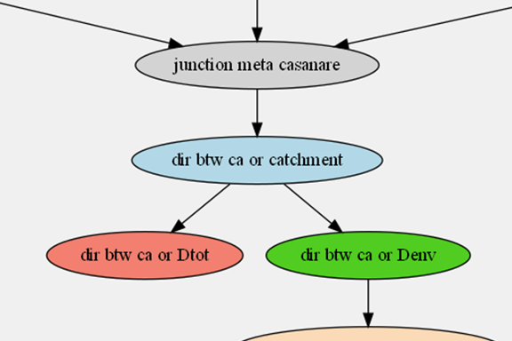

In OWF, the deliveries to users are represented using `piecewiselink` nodes. A `piecewiselink` node is a type of node in `pywr` that allows assigning differnt costs to different ranges of flow values. This is useful to represent the deliveries to users in OWF, as the `cost` of water delivery differ among the users.

For instance, the `piecewiselink` node below represents the deliveries to users within the Metica basin. The `max_flows` attribute is used to specify the maximum flows for each user in the basin, while the `costs` attribute is used to specify the cost of water delivery for each user. The `nsteps` attribute is used to specify the number of steps in the piecewise link, which is set to 4 in this case:


```json
    {
      "name": "metica_Dtot",
      "type": "piecewiselink",
      "nsteps": 4,
      "max_flows": ["metica_Dfwu", "metica_Dfwr", "metica_Dirr", "metica_Dliv"],
      "costs": -999
    },
```

One can note that the `costs` attribute is set to -999. This is because the `costs` attribute has not been filled yet by the `Build_OWF_CST.py` script. The `costs` attribute is filled based on the dispatch order defined in the `dispatch_order_*.csv` files located in the `parameters` folder (see section 6.3.1 above for more details).

The two `.json` code snippets below illustrate the same `piecewiselink` node once the `csots` attribute has been filled using either the cost values from the FCFS or PE scenarios:

**Scenario FCFS:**
In this example, urban customers get assigned with the highest priority (cost=-140.0), followed by rural customers (cost=-135.0), irrigation users (cost=-130.0), and livestock users (cost=-125.0). The `max_flows` attribute is used to specify the maximum flows for each user in the basin, while the `costs` attribute is used to specify the cost of water delivery for each user. 

```json
        {
            "name": "metica_Dtot",
            "type": "piecewiselink",
            "nsteps": 4,
            "max_flows": ["metica_Dfwu", "metica_Dirr", "metica_Dliv", "metica_Dfwr"],
            "costs": [-140.0, -135.0,  -130.0, -125.0]
        },
```

**Scenario PE:**
Note here how the order of the `max_flows` attribute has changed compared to the FCFS scenario. In this case, all urban customers are assigned with the same priority (cost=-85.0), followed by rural customers (cost=-65.0), irrigation users (cost=-45.0), and livestock users (cost=-25.0). 

```json
        {
            "name": "metica_Dtot",
            "type": "piecewiselink",
            "nsteps": 4,
            "max_flows": ["metica_Dfwu", "metica_Dfwr", "metica_Dirr", "metica_Dliv"],
            "costs": [-85.0, -65.0, -45.0, -25.0]
        },
```

Note that the maximum flows that can pass through `*_Dtot` nodes is equal to the sum of the flow values of the `max_flows` attribute, which is the sum of the flows for urban, rural, irrigation and livestock users in the basin (the symbol `*` could be replaced by any basin's name).

If more flows is available at the upstream node, it will flow to the other branch, which is the `*_Denv` node. These nodes represent the river stream flowing downstream to their connecting basin.

For instance, the `.json` code snippet below illustrates the `metica_Denv` node, which represents the river stream flowing downstream to the Metica basin. This node is also a `piecewiselink` node, but it has only two steps (nsteps=2) and the `max_flows` attribute is used to specify the maximum flows for the river stream flowing downstream to the basin. The `costs` attribute is set to -999, as it will be filled by the `Build_OWF_CST.py` script when the model is run. Note that since the `metica_Denv` node has `nsteps=2`, it means that, once filled, the `costs` attribute will contain two values, one for each step of the piecewise link.

The second value of the `max_flows` attribute is set to `null`, which means that there is no maximum flow for the river stream flowing downstream to the basin. This is because the river stream can carry any amount of water that is available at the upstream node.

```json
    {    
      "name": "metica_Denv",
      "type": "piecewiselink",
      "nsteps": 2,
      "max_flows": ["metica_to_dir_btw_gb_yu_Denv", null],
      "costs": -999
    },
```


## 9. Description of the python scripts in the `scripts` folder

- `OWF_CST.py`: This is the main script used to run the Orinoquia Water Futures model (OWF). It imports the necessary modules and runs the model using the parameters defined in the `OWF_ScenarioVariables.py` file. The script also generates the output files in the `results` folder.

- `Build_OWF_CST.py`: This script is used to build the `.json` files for the Orinoquia Water Futures model (OWF). It reads the parameters defined in the `OWF_ScenarioVariables.py` file and fills the relevant attributes in the `.json` files located in the `model_json/CST/models/` folder. The script is called automatically when running the `OWF_CST.py` script, so the user does not need to run it manually.

- `OWF_ScenarioVariables.py`: This script defines the parameters and scenarios used to run the Orinoquia Water Futures model (OWF). It includes the demand projections, climate scenarios, and other parameters used to run the model. The script is imported by the `OWF_CST.py` script to run the model.

- `ofm_water_demand.py`: This script contains the classes used to calculate the water demand for urban, rural, irrigation and livestock users in the Orinoquia region. It defines the `Freshwater_Demand`, `Irrigation_Demand`, and `Livestock_Demand` classes, which are used to calculate the water demand for the different water users in the Orinoquia region.

- `ofw_dam_operations.py`: This script contains the classes used to calculate the dam operations in the Orinoquia region (i.e., Bata and Guavio reservoirs). It defines the `Dam_Release` class, which is used to calculate the dam release as a function of the current storage and calendar months. The objective of the operations of the dams is to follow a guideline storage curve that is defined as the average monthly storage for each dam.

- `ofm_reservoir_volume_area.py`: (placeholder) This script was meant to host a python class to calculate the volume-area relationship for the reservoirs in the Orinoquia region. However, this script is currently empty and not used in the model because we could not have access to the storage-area curve for Bata and Guavio reservoirs. It can be used in the future to implement a class that calculates the volume-area relationship for the reservoirs in the Orinoquia region if the required data is made available.

- `ofm_reservoir_pet_prcp.py`: (placeholder) This script was meant to host python classes to calculate the  evaporation (ET) and precipitation over the reservoirs in the Orinoquia region. However, this script is currently empty and not used in the model because we could not have access to the data required to calculate the area of the reservoir. It can be used in the future to implement a class that calculates the ET and precipitation for the reservoirs in the Orinoquia region if the required data is made available.

- `environmental_flow_calculation_CST.py`: This script is used to calculate the environmental flow requirements for the Orinoquia region. This script was used to create the `minimum_flows_CST.csv` file located in the `input/parameters/` folder. 

- `Trend_Urban_and_Rural_Population_for_OWF_CST.py`: This script is used to calculate the urban and rural population projections for the Orinoquia region. It uses linear regression to extrapolate the population projections from historical records of the population in the Orinoquia Region. The script generates the `Projection_Urban_and_Rural_Population_for_OWF_CST.csv` file located in the `input/freshwater_demand/CST/` folder.

- `Trend_Crop_Livestock_for_OWF_CST.py`: This script is used to calculate the crop and livestock trend scenarios for the Orinoquia region. It calculates the historical trends for rice, cacao and oil palm tree planted areas, and for livestock numbers in the Orinoquia region (pigs, birds and cattle). The script generates the `Trend_CropType_and_Livestock_OWF.csv` file located in the `input/demand_trend_scenarios/CST/` folder.

- `ORINOQUIA_aquacrop_CST_NetIrrSMT100.py`: This script is used to run the Aquacrop-OSPy model for the Orinoquia region. It simulates the irrigation requirements for rice planted at two different dates (April 1st and August 15th) using the Net Irrigation Soil Moisture Target (NetIrrSMT) irrigation strategy. The script generates the output files in the `input/irrigation/CST/Aquacrop/` folder.

- `PerformanceMetrics_OWF_CST.py`: This script is used to calculate the performance metrics for the Orinoquia Water Futures model (OWF). It imports the necessary modules and calculates the performance metrics based on the output files generated by the `OWF_CST.py` script. The script generatesa netcdf file (`OWF_CST_annual_deficit_Mm3.nc`) the `results/CST/` folder. At the moment, the script calculates the frequency of deficit for each user type and each basin, and the annual maximum and average deficit for each user type and each basin, and the percentiles 95th and 75th of the annual deficit for each user type and each basin. Deficit metrics are also calculated for the whole basin. 

- `CRF_OWF_CST.py`: This script was used to create the Climate Response Function (CRF) figures that are in the presentation used in the kick-off meeting (cf. the Training branch). It used the netcdf file generated by the `PerformanceMetrics_OWF_CST.py` script to create the CRF figures. 

- `Plot_OWF_Output_timeseries.py`: This script was used to create the time series plots that are in the presentation used in the kick-off meeting (cf. the Training branch). It used the output files generated by the `OWF_CST.py` script to create the time series plots. 

- `map_CST_results.py`: This script was used to create the maps that are in the presentation used in the kick-off meeting (cf. the Training branch). It used the netcdf file generated by the `PerformanceMetrics_OWF_CST.py` script to create the maps. The script generates maps of the annual frequency of deficit for each user type and each basin.


- `download_CMIP6_projections.py`: This script is used to download the CMIP6 projections for the Orinoquia region. It downloads the data from the CDF (Climate Data Store) and saves it in the `data/CMIP6/` folder. 

- `process_CMIP6.proj.py`: This script was used to process the CMIP6 projections downloaded by the `download_CMIP6_projections.py` script. It processes the data (extract the relevant grid cells based on the region shapefile), calculate delta change factors, fit copula functions to represent the joint distribution of precipitation and temperature and generate random samples from the fit copula functions, and create scatter plot of changes in precipitation and temperature.

- `Plot_CDF_metrics_inferred_from_CST_n_CMIP6.py`: This script was used to create CDF that combine information from the likelihgood of future climate (using the random samples generated by the `process_CMIP6.proj.py` script) and the results from the vulnerability assessment (using the netcdf file generated by the `PerformanceMetrics_OWF_CST.py` script). The scripts generates CDF figures (not used in the kick-off meeting) that represent the future distribution of frequency of deficit for each user type and each basin. More infornation about this type of representation can be found in: François, B., Dufour, A., Nguyen, K.T.N., Bruce, A., Park, K.D., Brown, C., 2024. From many futures to one: climate-informed planning scenario analysis for resource-efficient deep climate uncertainty analysis. Clim. Change 177. https://doi.org/10.1007/s10584-024-03772-9

- `OWF_flowchart.py`: This script is used to create the flowchart of the Orinoquia Water Futures model (OWF). It uses the `.json` file located  in `model_json/CST/Parent/` folder to create the flowchart. 

- `parallel_coords_plot.py`: This script is used to create the parallel coordinates plot of the Orinoquia Water Futures model (OWF). It uses the netcdf file generated by the `PerformanceMetrics_OWF_CST.py` script to create the parallel coordinates plot. This script used the `plotly` python library, specifically designed to create interactive plots. Rather than creating a `.png` with the figure, the script generates an IP adress that can be opened in a web browser to visualize the plot interactively.

- `run_gr2m_CST.py`: This script is used to run the GR2M model for the Orinoquia region. It uses the parameters defined in the `GR2M_PARAMETERS_META_V03.csv` file to run the GR2M model and generate the streamflow data for the Orinoquia region. The script generates the output files in the `input/streamflow/CST/` folder.

- `gr2m.py`: This script contains the `gr2m` function, which is used to run the GR2M model for the Orinoquia region. 

